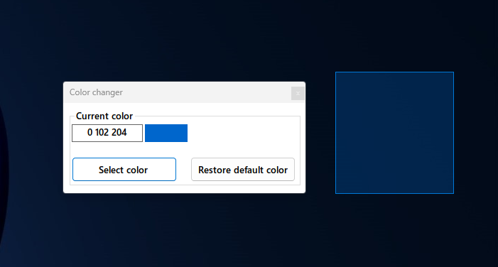
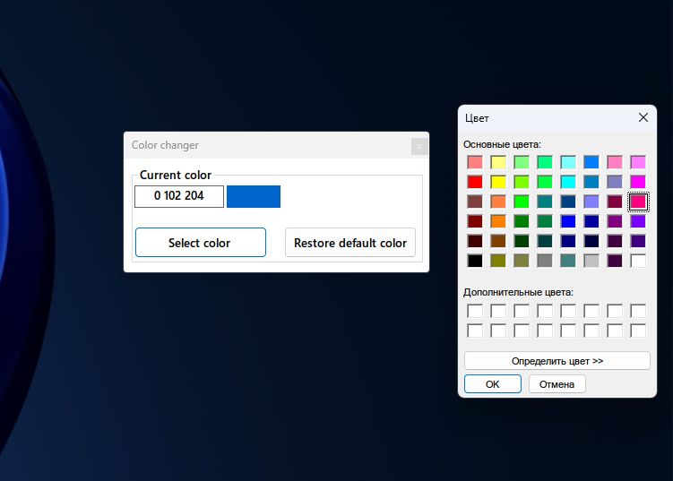
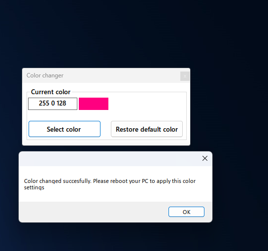
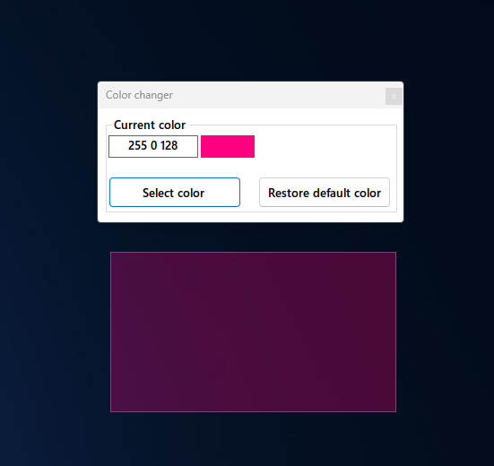

# ColorSelectionChanger
it's simple program can change color of selection zone in windows 10/11.

## Some screenshots

## Future features
- [ ] changing colors without reboot.(after i learn how to use ollydbg or x64dbg)
